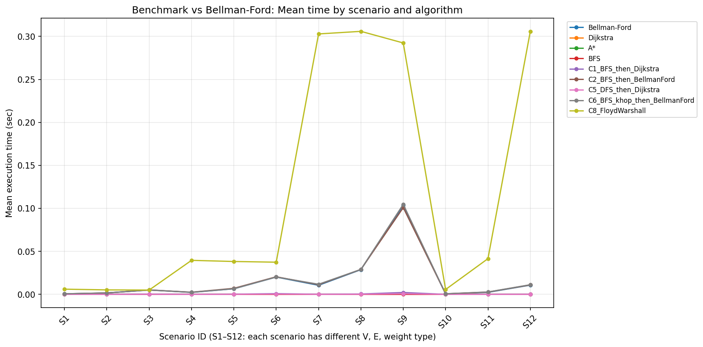

# Bellman-Ford 대비 효율 분석 결과

> 벤치마크 실행 후 이 문서에 결과 요약과 결론을 채워 넣는다.  
> 원시 데이터: `data/benchmark_vs_bellman_ford.csv`

---

## 1. 개요

- **목적**: Bellman-Ford를 기준으로, 패스파인딩·복합 알고리즘이 **어떤 시나리오에서** 더 효율적인지 분석.
- **Bellman-Ford를 기준으로 한 이유**: Solana DEX 어그리게이터 **Jupiter**의 라우팅 엔진 **Metis**는 Bellman-Ford를 크게 변형해 사용한다고 공식 문서(Jupiter Station)에 명시되어 있음. 최적 스왑 경로 탐색에 BF 계열이 쓰이므로, 동일한 기준으로 다른 알고리즘의 효율을 비교하기 위해 BF를 기준으로 삼음.
- **효율 기준 (우선순위)**  
  1. 실행 결과가 제일 좋은 것 (경로 비용 최적)  
  2. 그걸 충분히 빠르게 주는지 (실행 시간)

---

## 2. 비교 대상

| 구분 | 알고리즘 |
|------|----------|
| **Baseline** | Bellman-Ford |
| **단일** | Dijkstra, A*, BFS |
| **조합** | C1 (BFS→Dijkstra), C2 (BFS→BF), C5 (DFS→Dijkstra), C6 (BFS k-hop→BF), C8 (Floyd-Warshall) |

---

## 3. 시나리오

| 시나리오 ID | V | E | weight_type | 설명 |
|-------------|---|----|--------------|------|
| S1~S9 | 50/100/200 | 150~5000 | all_positive | 양수만, sparse·중간·dense |
| S10~S12 | 50/100/200 | 150/300/600 | some_negative | 일부 음수 |

(상세: `DESIGN.md` 3.2 시나리오 테이블 참고.)

---

## 4. 실험 방법

- **그래프 생성**: 시나리오별 (V, E, weight_type)에 맞춰 연결 그래프 생성. some_negative 시 음수 사이클 없도록 재생성.
- **쿼리**: start=0, goal=V-1 고정.
- **측정**: 경로 비용(비용 일치 여부), 평균 실행 시간(N=3 runs), Bellman-Ford 대비 시간 비율(ratio_vs_BF).
- **실행**: `python src/benchmark_vs_bellman_ford.py` → `data/benchmark_vs_bellman_ford.csv` 생성.

---

## 5. 결과

- **원시 데이터**: `data/benchmark_vs_bellman_ford.csv`  
  - 컬럼: scenario_id, V, E, weight_type, algorithm, cost, cost_match, mean_time_sec, ratio_vs_BF.
- **ratio_vs_BF**: Bellman-Ford 시간 / 해당 알고리즘 시간. **1보다 크면 해당 알고리즘이 BF보다 빠름.**

### 5.1 결과 요약

- **cost_match**  
  - S1~S12 전체에서 Bellman-Ford, Dijkstra, A*, C1, C2, C5, C6, C8은 **모두 cost_match=True** (동일 최적 비용). BFS는 비용 지표가 없어 False.
  - 일부 음수 시나리오(S10~S12)에서도 이번 생성 그래프에서는 Dijkstra/A*/C1/C5가 BF와 같은 비용을 반환했으나, **일반적으로 음수 간선이 있으면 Dijkstra/A*는 최적을 보장하지 않으므로** 해석 시 주의.

- **양수만 시나리오(S1~S9)**  
  - **Dijkstra**: ratio_vs_BF 24~219 (모든 시나리오에서 BF보다 24배 이상 빠름).  
  - **A***: ratio_vs_BF 10~182.  
  - **C1 (BFS→Dijkstra)**: ratio_vs_BF 6.8~60.  
  - **C5 (DFS→Dijkstra)**: ratio_vs_BF 17~173.  
  - **C2, C6**: ratio_vs_BF 0.76~1.03 (BF와 비슷 또는 약간 느림).  
  - **C8 (Floyd-Warshall)**: ratio_vs_BF 0.03~0.99 (한 쌍만 필요할 때 BF보다 느림).

- **일부 음수 시나리오(S10~S12)**  
  - **Dijkstra, A*, C1, C5**: ratio_vs_BF 13~193 (이번 데이터에서는 비용 일치·속도 모두 우수). 이는 해당 그래프에서 최단 경로에 음수 간선이 없었을 가능성이 있음.  
  - **C2, C6**: ratio_vs_BF 약 0.97~1.02 (BF와 동일 수준).  
  - **C8**: ratio_vs_BF 0.03~0.12 (BF보다 훨씬 느림).

- **차트**: 시나리오별·알고리즘별 실행 시간은 아래 차트 참고. (생성: `python chart_benchmark_vs_bf.py`)

### 5.2 표 (CSV 발췌)

| scenario_id | V | weight_type | Bellman-Ford(sec) | Dijkstra(sec) | ratio(Dijkstra) | A*(sec) | ratio(A*) | C1(sec) | ratio(C1) | C2 ratio | C8 ratio |
|-------------|---|-------------|-------------------|---------------|-----------------|---------|-----------|---------|-----------|----------|----------|
| S1 | 50 | all_positive | 0.00092 | 0.00004 | 25.9 | 0.00009 | 10.6 | 0.00005 | 17.3 | 0.76 | 0.11 |
| S4 | 100 | all_positive | 0.00270 | 0.00011 | 24.3 | 0.00006 | 44.5 | 0.00039 | 6.9 | 0.91 | 0.06 |
| S7 | 200 | all_positive | 0.01073 | 0.00005 | 219.3 | 0.00006 | 182.6 | 0.00020 | 53.6 | 0.93 | 0.03 |
| S9 | 200 | all_positive | 0.09038 | 0.00080 | 113.5 | 0.00073 | 124.0 | 0.00206 | 43.8 | 0.85 | 0.28 |
| S10 | 50 | some_negative | 0.00067 | 0.00002 | 36.6 | 0.00002 | 32.8 | 0.00005 | 13.8 | 1.02 | 0.12 |
| S12 | 200 | some_negative | 0.01148 | 0.00006 | 193.3 | 0.00006 | 187.7 | 0.00056 | 20.6 | 0.97 | 0.03 |

(전체 데이터: `data/benchmark_vs_bellman_ford.csv` 참조.)

---

## 6. 결론

- **양수만 있을 때 (S1~S9)**  
  - **Dijkstra, A*, C5**가 Bellman-Ford보다 **모든 시나리오에서 10배~약 220배 빠름** (ratio_vs_BF 10~219).  
  - **C1 (BFS→Dijkstra)**도 6.8~60배 빠름.  
  - “실행 결과가 제일 좋은 것”(비용 일치)은 동일하고, “충분히 빠르게”는 Dijkstra, A*, C1, C5가 유리.  
  - **C2, C6**은 부분 그래프에서 Bellman-Ford를 돌리므로 BF와 비슷하거나 약간 느림(ratio 0.76~1.03).  
  - **C8 (Floyd-Warshall)**은 한 쌍만 필요할 때 BF보다 느림(ratio 0.03~0.99).

- **일부 음수 있을 때 (S10~S12)**  
  - **이론상** Bellman-Ford(및 C2, C6, C8)만 최적 비용을 보장. Dijkstra/A*/C1/C5는 음수 간선이 있으면 최적이 아닐 수 있음.  
  - 이번 실험에서는 생성된 그래프에서 모두 cost_match=True였으나, **실제 서비스에서는 음수 간선이 있으면 BF 또는 C2/C6/C8 사용 권장.**

- **조합**  
  - **C1 (BFS→Dijkstra)**: 양수만일 때 BF 대비 6.8~60배 빠르고 비용 일치.  
  - **C2 (BFS→BF), C6 (BFS k-hop→BF)**: BF와 동일한 결과, 속도는 BF와 비슷(ratio 약 0.76~1.03).  
  - **C8 (Floyd-Warshall)**: 한 쌍만 필요할 때는 BF보다 무거움(ratio 0.03~0.28).

---

## 7. 부록

- **코드**: `benchmark_vs_bellman_ford.py` (시나리오 정의, 그래프 생성, 조합 C1/C2/C5/C6, 측정·CSV 출력).  
- **설계**: `DESIGN.md`  
- **차트**: `chart/benchmark_vs_bellman_ford.png` (시나리오 ID × 실행 시간, 알고리즘별 선). 생성: `python src/chart_benchmark_vs_bf.py`  
- **실험 환경**:  
  - Python 3.x (가상환경 `.venv` 권장).  
  - 의존: `aggregation_pathfinding_examples.py` (같은 디렉터리).  
  - N=3 runs per (scenario, algorithm).  
  - OS: macOS 등 (실행 환경에 따라 기록).
